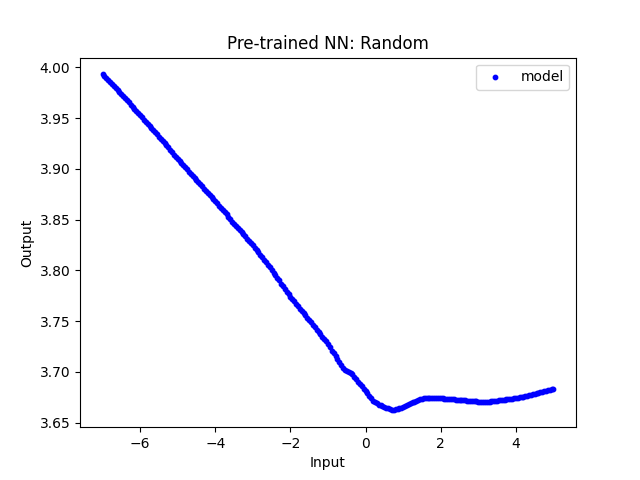

# SimpleNN

## What This Is and Why I Made This
When I started with machine learning, I made it my goal to understand how neural networks work and created a library for building and training simple neural networks in Java. Since then, I've been working more with Python (numpy, pandas) and machine learning libraries like PyTorch. 

For this reason, I rewrote all the code to be neater, more efficient (using numpy ndarrays instead of lists), and with more capabilities to simulate PyTorch. I also included essential tests to verify that the neural network works as expected.

## What It Can Do
- Build a fully connected feedforward neural network.
- Support for multiple activation functions (e.g., ReLU, Sigmoid).
- Support for Softmax and Cross-Entropy Loss, as well as MSE (Mean Squared Error).
- Support for input normalization.
- Can be trained using backpropagation.
- Can generate training data based on functions.
- Can test the neural network against data.

## What It Can't Do
- Batch training (only supports single sample updates).
- Use optimizers other than gradient descent.
- Force Softmax and Cross-Entropy Loss to be used together (they are separate).

## How to Use It

1. **Creating a Layer**:
    - `Layer(weights_matrix, biases_matrix, activation_function)` 
    - Or, `Layer(num_inputs, num_neurons, activation_function)`
    - The activation function defaults to `None` if not specified.
    - If initialized with the second method, the weights are randomly initialized based on the activation function used.

2. **Creating the Network**:
    - `NeuralNetwork(layers, normalize_inputs=True/False)`
    - `layers` is a list of `Layer` objects.
    - `normalize_inputs` defaults to `False`, but can be set to `True` to enable input normalization.
    - The network can also be initialized by pasting the string representation of another neural network (`.__repr__()` method). This allows for easy saving and reloading of networks.

3. **Generating Data, Training, and Testing**:
    - `nn.generate_data(num_samples, range, lamda, noise)`
    - `nn.train(input, expected, epochs, learning_rate, decay)`
    - `nn.test(input, expected)` returns `(predicted, loss)`.

## A Brief Explanation of Each Test (All Passed)
- **linear.py**: Ensures that a perceptron can correctly perform linear regression.
- **XOR.py**: Tests if the network can solve the classic XOR problem using two layers of neurons.
- **non_linear.py**: Verifies that a more complicated network (3 layers) can match the function 0.25x³ − 1.5x² − 3 with 3 roots and 2 extrema.
- **logarithmic.py**: A non-linear test with poor horizontal scaling.
- **circular_bound.py**: Tests the network’s ability to recognize curves and more complicated bounding.
- **iris.py**: Tests against the classic Iris dataset, showing the network’s ability to handle multiple inputs and outputs, as well as Softmax and Cross-Entropy Loss working as expected.

## Example Results

### Circular Boundary Test
Demonstrates the network learning a non-linear decision boundary.  
Average Accuracy: 98.2359, SD: 0.68  (10 tests)

---

### Non-Linear Function Approximation
Comparison between an untrained network and a trained network fitting the function  
0.25x³ − 1.5x² − 3.

#### Before Training

#### After Training

## AI Useage
- AI is a tool to speed up learning, not replace it.
- All design concepts and 90% of the code is written by me. AI useage mostly comes in with debugging specific, contained issues (it is unable to even describe weight matrix sizes) as well as some specific matplotlib tools and commenting.
- Grammar and markdown checked with AI

## License
This project is licensed under the MIT License - see the [LICENSE](LICENSE) file for details.
